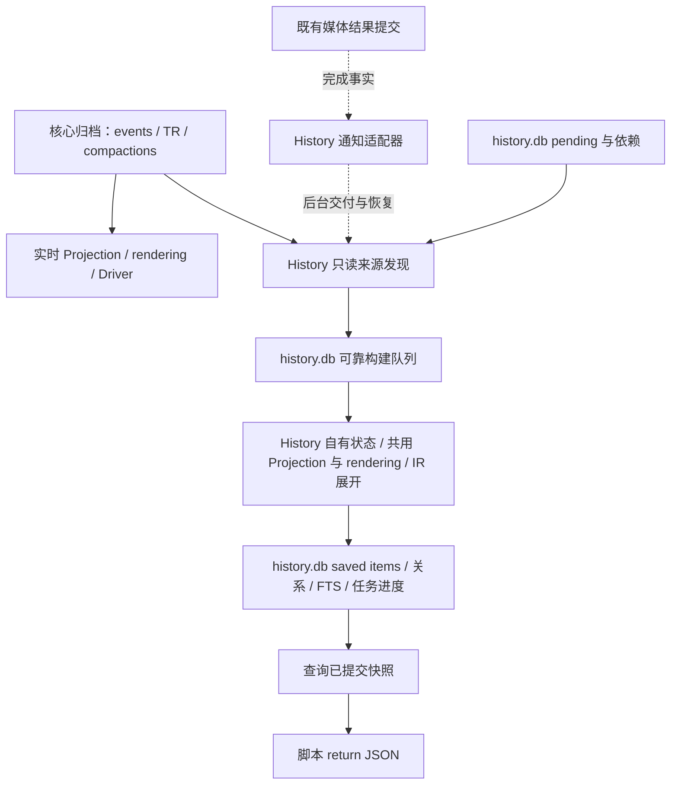

# Cahciua 历史回查层实现草案

状态：2026-10-10 异步同步架构及对应代码已改造。第 3、6 节描述同步职责，完整规则见 [history-sync-design.md](history-sync-design.md)，实现契约见 [history-input.md](history-input.md)。可靠媒体接收/恢复已替换 rendering hint 与正常 pending 轮询。查询进程、SQL guard/SDK、CodeAct 和 memory 仍未实现。

历史回查的三个主要归档来源是 events、TR 和 compactions。聊天消息、模型输出及工具执行组成连续对话，compaction 摘要则作为压缩后的历史关键节点，帮助模型定位较长时间范围内的话题、决定和执行结果，再展开原始证据。摘要是提高历史回查召回率的核心入口，不能只作为 replay 的辅助数据处理。

实时上下文与回查共用 Projection、消息 rendering 和时间线组装；实时上下文在此基础上执行模型兼容、去重、裁剪等 transform，检索侧把完整的可读条目和每一次已保存摘要写入独立 SQLite 检索库。

检索库中的 transcript 是可更新的物化视图。编辑直接更新对应消息，保留原时间线位置；原始 events 和 TR 继续作为权威来源。独立构建进程是模型侧之外的另一个 consumer：从已提交归档分页发现来源，将构建职责可靠保存到 history.db，再调用共用 rendering 并物化。媒体完成进入同一任务队列，通知交付与恢复全部在异步分支处理。主进程不等待接收 ACK、构建或追平；背压停在 History 内部。第一版采用 FTS5，提供常用 helper 和受限 raw SQL，不引入向量检索或复杂检索策略。

## 1 目标与范围

第一版完成“找到相关内容 → 展开前后文 → 查看完整工具调用和结果 → 保留来源引用”的闭环。

- 查询脚本以 JavaScript 组合多个查询、循环、分组和裁剪，只将最终 `return` 返回给模型。
- 常见查询使用 helper；任意只读关联、统计、JSON 条件、CTE 和窗口计算使用 raw SQL。
- 查询当前群的完整历史，不受实时上下文的 compaction cursor 和 token 预算限制。
- Agent 面向聊天消息、模型输出、工具执行和摘要，无需了解 TR、IC 或 runtime/service event。
- Tool call 与 result 的所属输出、参数、结果和配对关系完整保留。
- 群作用域由宿主绑定，helper、SQL 和引用展开均不能扩大授权范围。
- Compaction summary 和后续 memory 能通过稳定引用回查证据。
- Compactions 与消息、工具执行一样进入默认搜索；摘要命中可展开覆盖窗口、直接来源和继承摘要，作为高召回的历史导航节点。

第一版不实现长期 memory 写入、自动整理、跨群共享、向量检索、查询改写和额外重排序。它也不补建 trigger message → wake-up → TR 的因果链：时间线与前后文足够满足本次需求，时间邻近不表示触发关系。

Service event 和原始 runtime event 不作为独立搜索或时间线条目。后台任务完成信息可以挂到对应工具执行上，但不要求 agent 查询内部事件类型。Probe 输出不属于主对话 transcript。

## 2 当前 replay 如何形成连续上下文

当前 events、`turn_responses_v2` 和 compactions 位于同一个 SQLite 数据库。数据库没有预先保存一份完整的 session view；运行时从归档重新构造。

Compaction 不写入 events 或 TR。每次压缩结果单独追加到 compactions，保存 summary、old/new cursor、created_at 和 usage；composeContext 仅在模型输入中把最新 summary 包装成 user message。构建进程直接消费 compactions，不从模型请求反解析这一包装，也不因摘要被重复放入模型上下文而重复建立记录。

| 阶段 | 当前行为 | 可复用部分 |
| --- | --- | --- |
| 启动 replay | 按 `(received_at, id)` 读取事件，逐条 reduce 成 IC，再 render 成 RC | 消息状态演进、发送者快照、回复快照、编辑删除、self-event 合并 |
| Wake-up | 加载当前 cursor 后的 TR，解码保存的 `ConversationEntry[]` | 模型输出与工具调用、结果的完整结构 |
| 时间线合并 | RC 使用 `receivedAtMs`，TR 使用 `requestedAtMs`；相同时间 RC 在前 | 消息与模型执行的排序规则 |
| Context transform | 过滤 self-sent、处理 reasoning、删除部分旧 TR、截短工具结果、加入 summary、按 token 裁剪 | 模型输入专用处理，不能直接作为完整检索内容 |

有 compaction 时，启动只恢复 cursor 后的活动窗口，模型输入由 summary 加上窗口内的 RC/TR 组成。这里恢复的是继续运行所需的上下文，不是逐字重放每次历史模型请求，也不会重新执行历史工具。

TR 对应一个已经完成并持久化的模型/工具步骤，不是整个 wake-up。一次 wake-up 可以包含多个 TR。工具调用位于 assistant entry 的 parts 中，结果为独立 toolResult entry，通过同一 TR 内的 `callId` 配对。

现有 Projection 的 edit 已经更新原消息内容并保留 `receivedAtMs`；delete 标记原消息；synthetic self-event 与权威 Telegram echo 合并。这些语义应继续只有一个实现。

参考：[启动 replay](../src/startup/index.ts)、[Pipeline](../src/pipeline.ts)、[Projection](../src/projection/reduce.ts)、[Rendering](../src/rendering/index.ts)、[mergeContext](../src/driver/merge.ts)、[composeContext](../src/driver/context.ts)。

## 3 共用表示与职责边界



这里共用的是内容构造、来源身份、时间线顺序和工具结构，不要求模型输入与检索返回使用完全相同的外层格式。

| 所有者 | 拟议职责 |
| --- | --- |
| `src/projection/` | 继续拥有纯事件 reducer 和消息状态演进；供实时窗口与历史恢复共用 |
| `src/rendering/` | 生成带身份、结构化元数据和可读内容的消息级结果；共用正文、回复、转发和附件格式 |
| `src/conversation/` | 新增共享对话组装模块，拥有时间线排序和 IR 工具配对，不依赖 Driver 或数据库 |
| `src/driver/` | 选择实时工作窗口，执行模型兼容、去重、摘要与 token transform，绑定查询能力 |
| `src/history/` | 独立构建进程、有界消费与 cursor、transcript 物化、查询 SDK、作用域和脚本执行 |
| `src/db/` | 原库连接、schema、核心归档持久化与只读来源接口；history 的 schema/迁移/写入属于 `src/history/` |
| `src/startup/` | 资源构造、恢复与关闭 |

Projection 和 Rendering 不写数据库、不调用历史服务；持久化由外层协调者消费结果。查询结果通过现有 tool result 进入 TR，不反向插入 IC。索引维护不唤醒 Driver。

### Rendering 与 transform 的 effect

现有 rendering 入口接受 consumer 自有 IC 和显式输出范围；Driver 选择模型窗口和策略，compaction 更新不重新发布正文。History 保持独立的状态和输出范围，可靠任务不能挂到实时 context effect 上。

| 路径 | 输入变化 | 负责的工作 |
| --- | --- | --- |
| Rendering | IC 消息内容、附件描述及显示格式依赖 | 构建或更新消息级基础表示 |
| 模型视图 transform | 基础表示、TR、cursor、summary、访问策略、模型与预算 | 选择窗口、遮罩、去重、兼容处理、组装及裁剪 |
| Compaction effect | 当前工作窗口与 token 条件 | 异步生成摘要，先持久化，再推进 compaction metadata |
| History consumer | 已提交来源、持久构建任务及媒体完成后的定向任务 | 自行调用共用 rendering，在独立进程原子更新条目、FTS 与任务进度 |

Cursor、summary 或 token 预算变化不使消息 rendering 失效，也不触发整批历史消息重新发布。摘要生成和持久化不是纯 transform，仍由 compaction controller 执行；纯 transform 不产生数据库或模型调用副作用。

“完整基础表示”指每条消息保留未裁切内容，不要求全历史 RC 常驻主进程。消息结果按内容及格式依赖复用，edit 更新目标；过期缓存可以释放。构建进程落后时不通过保留所有 rendering 结果来实现可靠性，而是从持久化队列恢复。

### 共用 rendering 结果

现有基础 rendering records 已有结构化身份和元数据，与 Driver 的模型 segments 分开。图片 content piece 仍可能持有 Sharp 对象；History 使用 JSON-safe 完整 transcript，不直接序列化运行时 RC 数组或从 XML 反解析查询字段。

共同消息级表示保留以下信息，具体契约见 [rendering-interfaces.md](rendering-interfaces.md)：

| 内容 | 用途 |
| --- | --- |
| `chatId`、`messageId`、稳定 ref | 群过滤、消息定位、edit 更新 |
| 原始排序时间、发送时间、编辑时间、删除状态 | 连续时间线与状态查询 |
| sender 快照、reply target、转发信息、isSelfSent | 结构过滤、直接关系和模型去重 |
| 可读正文、正文纯文本、附件描述 | transcript 展示和 FTS |
| 来源定位与所覆盖的 source revision | 回查与判断 rendering 缓存是否对应归档版本 |
| 模型所需媒体引用 | 模型分支使用；检索存储不保存 Sharp 对象或图片字节 |

使用现有共同消息 rendering 入口。实时与 History 分支各自调度这个共同入口，不分别实现格式化规则。History 的可靠任务不依赖主分支临时 RC 对象成功传输；持久职责完成前，rendering 失败或输出提交失败均可重试。

Compaction cursor、屏蔽成员遮罩等属于视图选择。共用的消息结果应在这些处理之前产生：模型分支选择工作窗口并执行遮罩；检索分支保存完整条目，在查询时执行当前授权策略。未遮罩内容始终只存在于宿主内部，不能经 SQL 或 context 绕过屏蔽规则。

媒体描述复用现有 hydration/resolver。历史恢复可以读取已有缓存，不因建索引重新调用 LLM。尚无描述的附件保留类型、名称等已有信息；已知缺失的描述或动画 hash 补齐后定向刷新对应消息。缓存不是不可变证据，重建可以使用当前缓存生成新的展示文本，来源引用保持不变。

### 共用时间线组装

从 `mergeContext` 提取带 provenance 的排序单元，再分别执行模型序列化和检索展开。连续聊天条目在模型输入中可以合并成 user message，检索侧保留每条消息的独立身份。

排序使用可持久化的稳定键：`(time_ms, source_order, source_id, entry_index, part_index)`。消息时间取原消息的 `receivedAtMs`；模型输出及工具调用、结果沿用所属 TR 的 `requestedAtMs`；相同时间消息在模型执行之前，同一步内保留 IR 顺序。消息的 source_id 使用首次归档事件 ID，模型执行使用 TR ID。不能使用检索表自增 ID 决定对话顺序。

检索时间线中的 summary 节点使用 compaction 的 created_at 排序，source_id 为 compaction ID；同时间排在消息和模型执行之后，同时单独展示覆盖窗口。模型分支仍只把当前摘要作为前缀，不把所有历史摘要再次混入实时对话。

当前 merge 的同时间次序只有 RC/TR 类别和 entry index；提取共同模块时需补齐跨 TR 的稳定次序，并用 characterization tests 明确相同时间的行为，不声称已有代码已经具有完整排序键。

检索库保存独立条目，不持久化“连续若干消息合成的一条 user message”。新增 TR 只改变读取时的组装边界，不导致重写相邻聊天内容。

工具配对只在同一 TR 的 `callId` 范围内进行。共享模块保留原 entry/part 位置、所属输出和结果顺序；只含工具调用的输出也必须出现。工具结果命中时能够回到调用和所属输出，不能只返回一段孤立日志。

### 模型 transform 与检索展开

| 操作 | 模型输入 | 检索 transcript |
| --- | --- | --- |
| 选择 compaction 工作窗口 | 需要 | 不受 cursor 限制 |
| 处理 provider reasoning 兼容 | 按当前模型处理 | 默认不公开 reasoning 正文或 opaque 数据 |
| 过滤 self-sent 聊天重复 | 沿用 Driver 语义 | 保留消息身份，以 sent_message 关系连接调用，展示时避免重复倾倒正文 |
| 删除旧的无工具 TR | 沿用现有策略 | 保留已保存的可读输出 |
| 截断旧工具结果与 token 裁剪 | 需要 | 存储不截断；仅对返回量分页、裁剪 |
| Summary | 作为活动上下文前缀 | 保留每次摘要，作为默认可搜索的历史关键节点及来源窗口入口 |
| Service/runtime 节点 | 实时上下文按现有语义使用 | 不独立展示；完成信息挂到工具执行 |

因此不能直接索引 `composeContext` 的最终 entries。共同组装在这些有损处理之前；现有 transform 的输入顺序与行为应通过测试保留，不能为了复用悄悄改变模型上下文。

## 4 两个数据库

使用一个进程级检索库，例如 `./data/history.db`，所有群仍通过 chat_id 区分。它不是每群安全副本，也不是第二份权威归档。

| 数据库 | 职责 | 生命周期 |
| --- | --- | --- |
| 原库，例如 `cahciua.db` | events、TR、compactions、后台任务等权威数据，服务 replay | 必须保存与备份 |
| `history.db` | 可更新 transcript、工具关系、摘要、FTS 和同步进度 | 可以从原库重建 |

检索库使用独立 schema 和 Drizzle 迁移。history 不给原库增加字段、表、索引、触发器或同步写入；同步指纹、定位索引、扫描进度和待处理观察队列全部属于 history.db。归档写入与检索写入不跨库假装原子提交。

检索库故障不回滚已成功提交的聊天事件或 TR，不阻塞 Telegram、Driver 或模型调用。构建进程保留落后进度，恢复后分批重试。查询读取已经提交的索引快照，并明确返回构建覆盖范围与落后状态；未构建不能解释为没有历史。

独立文件的目的在于分开归档与检索模型、迁移和重建生命周期。跨群读取限制仍由宿主的受限视图和 SQL 授权检查负责。

## 5 Transcript 存储和来源引用

### 消息

每个 `(chat_id, message_id)` 对应一条消息记录。message 建立记录；edit 更新正文、附件和 edited_at；delete 保留身份与原时间并标记删除，默认搜索排除。删除状态不要求抹去内部来源内容，但任何公开视图不能通过 JSON 列泄露被当前策略隐藏的正文。

消息记录保存足够的结构化投影状态，以便重启后的增量更新和重新 rendering。历史回填与 live 更新使用相同 Projection/rendering 规则；不会维护另一套 SQL 实现的 edit/delete 语义。

默认搜索针对最新 transcript，不把每次 edit 作为新命中。历史版本留在原始事件归档，需要核对时通过消息的 provenance refs 和 context 展开。

消息回复快照沿用 Projection 的语义：发送者与引用内容是当时的快照，后续编辑原消息不自动改写既有回复的引用。修订归档后恢复消息时，也必须保留这一规则。

### 模型输出与工具执行

模型输出按原 IR entry 保存可读内容和工具成员关系，调用按 part 保存，结果按 entry 保存。数组位置不能因省略 reasoning 或图片而重新编号。

| 记录 | 主要字段 |
| --- | --- |
| 消息 | ref、chat_id、message_id、source_event_id、time_ms、timestamp_sec、edited_at、sender_id、sender_json、reply_to_ref、deleted、is_self_sent、body_json、rendered_text、text、source_refs_json |
| 输出 | ref、chat_id、step_ref、entry_index、time_ms、model_name、body_json、text |
| 工具调用 | ref、chat_id、output_ref、step_ref、part_index、call_id、tool_name、args_json、result_ref、completion_json、time_ms |
| 工具结果 | ref、chat_id、call_ref、step_ref、entry_index、call_id、tool_name、payload_json、result_json、text、requires_follow_up、time_ms |
| 摘要 | ref、chat_id、summary、old_cursor_ms、new_cursor_ms、created_at、previous_summary_ref、source_refs_json、usage_json |
| 搜索单元 | id、ref、chat_id、kind、time_ms、sender_id、tool_name、parent_ref、call_ref、text |
| 关系 | from_ref、to_ref、kind |

`payload_json` 保留当时保存的 string/parts 形状；`result_json` 仅在字符串本身为有效 JSON 时填入。工具参数与结果文本完整保存，不因索引或 helper 的预览上限截断。图片以描述与省略标记表示；reasoning 只保留存在与类型信息。输出保留这些信息的原始位置和所属关系，不复制 provider wire 对象。

`step_ref` 仅用于查询同一次已完成模型步骤，不要求 agent 了解 TR 存储。需要模型/usage 的 SQL 分析时，可提供 executions 元数据视图，以 step_ref 连接 outputs；每步 usage 只存一份。

### Compaction 摘要作为历史关键节点

每一行 compactions 对应一条稳定的 summary saved item，所有历史摘要都保留和索引，不只保留最新一条。搜索文本来自完整摘要正文；FTS 索引不受实时 compaction cursor 或摘要预览长度限制。

原始消息分散在长对话里，模型可能只记得话题或结论，未必记得原文关键词。摘要把话题、决定、人物和工具执行结果集中在一个入口中，使模型可以先定位相关历史区段，再读取消息与工具细节。常规历史查询说明应包含“搜索摘要 → 展开来源 → 核对原文”的路径；这使用同一 FTS5 和 SDK，不增加向量检索或自动重排序。

关键节点保留三类不同的定位信息：

| 信息 | 意义 | 回查方式 |
| --- | --- | --- |
| 本次新增输入窗口 `(chat_id, [old_cursor_ms, new_cursor_ms))` | 指定群中此次压缩新纳入的聊天和模型执行范围 | context 从摘要取得群作用域，返回该群窗口内的有界记录及 thread 过滤条件，可继续分页 |
| 明确的消息/输出/工具来源 refs | 摘要中保留的具体证据定位 | context 展开对应消息、输出或完整调用/结果 |
| previous_summary_ref | 此次生成实际使用的上一份摘要 | 沿 previous_summary 关系继续回查更早关键节点 |

摘要可能继承更早内容，因此新增输入窗口不能代表全部语义来源。当前原库没有保存上一份摘要 ID 或精确来源 refs，history 明确保留为空，不按时间邻近猜测继承关系，也不为回查同步修改原库。若未来核心 compaction 独立提供这些权威元数据，history 可只读消费；这不是当前 history 接入的前置迁移。即使没有精确 refs，窗口信息仍提供回查入口。

摘要的 created_at 是生成时间，old/new cursor 是覆盖范围边界，两者在 schema 和返回结构中分别展示。默认时间线不把摘要冒充某成员的聊天发言；模型可以用 kinds: ['summary'] 浏览节点，或用 SQL 按覆盖窗口相交条件定位时间范围。摘要用于定位和导航，结论核对仍读取对应原始消息和工具结果。

窗口始终绑定摘要行的 chat_id。不同群的相同 old/new cursor 表示不同历史区段；展开来源和继承摘要都必须校验同群。这里的时间边界是 compaction 语义，不是构建进度，不能用最大时间戳推断其他群是否完成索引。

summary_source 与 previous_summary 关系只能来自已经保存并校验过的引用，目标必须属于当前群。历史建库、重建和 live 更新采用同一套关系提取规则。

### 稳定引用

| 引用形式 | 定位 |
| --- | --- |
| `message:456` | 宿主绑定群内的逻辑消息 |
| `output:42/entry:0` | 来源 TR 42 的输出 entry |
| `call:42/entry:0/part:1` | 来源 TR 内的调用 part |
| `result:42/entry:1` | 来源 TR 内的结果 entry |
| `summary:8` | 来源 compaction 8 |
| `event:123` | 显式核对消息版本时使用的来源事件，不是默认 transcript 条目 |

引用由原库 ID 和原 IR 位置构成，不依赖检索行 ID、内容哈希或 provider callId 的全局唯一性。重建不改变引用。

所有引用都在当前群作用域内解析；其他群和经来源确认不存在的目标返回 not_found，本群被当前策略隐藏的目标返回 redacted。当前群存在但尚未构建的目标按第 6 节返回 not_indexed。当前摘要中的 `msg#ID` 仍是群内消息 locator。新的结构化引用一旦公布即保持稳定，不依赖以后更换检索 schema。

消息引用定位当前可变 transcript；event 引用定位来源归档行。原库媒体 backfill 可能更新事件附件，event 引用也不承诺逐字节不可变。第一版不公开 service/runtime 事件原文，event 引用只支持消息及其 edit/delete 证据。

## 6 完全异步的独立构建分支

完整设计见 [History 异步同步架构](history-sync-design.md)。以下规则已落实于同步代码；查询读取契约仍为后续实现。

### 职责与可靠性

主进程只完成既有核心归档、实时 Projection/rendering、Driver 和媒体处理。History 的就绪、接收、持久入队、ACK、构建和消费都不能进入核心流程的等待条件或错误重试。

History 从只读原库分页发现 events、TR 和 compactions，将来源定位、目标、媒体依赖和构建任务持久保存在 history.db；与发现 ID 游标同事务提交。随后独立消费任务，通过共用 Projection/rendering 和 IR 展开生成 saved items。输入不可丢弃：未入队不推进来源游标，未完成不推进消费位置。

原库不新增同步字段、表、索引、触发器、日志或迁移。History 拥有唯一 writer、自有稀疏状态、可靠队列、pending、重试和恢复。共享 rendering 实现不意味着主进程负责可靠发送每个临时 RC 对象；已取消可丢弃 hint 输入模式。

### 分页、新 ID 与媒体完成

初次捕获有限 ID 上界，建立 History 私有索引并按群分页构建基线。持续同步只读持久 ID 水位后的新行，包括时间较早的新行。正常编辑、删除、TR、runtime 和摘要均由新增 ID 覆盖；来源游标不回到第一页。

旧行的明确例外是既有动画 hash 回填。History 在发现缺失 hash/描述时持久登记 event ID/cache key 和受影响消息。媒体生产者完成既有写入后发布完成事实，通知适配器后台交付；History 先将定向检查任务写入持久输入队列并 ACK，随后通过既有观察/消费链路调度刷新。接收 ACK 只表示输入事务完成，由后台适配器等待，不由核心流程等待。

正常媒体补齐不定时轮询 pending。启动、重连、通知缺口和明确恢复时，仅分页核对已登记缺失目标；登记后重读结果覆盖“完成先于登记”的竞争。通知适配器内存满时保留并重试恢复请求，接收方持久安排 pending 核对。主进程崩溃丢失内存通知后，恢复仍由归档和 History pending 支撑，不宣称跨库原子性。

### 进度和事务

| 进度 | 含义 | 提交条件 |
| --- | --- | --- |
| 来源发现 ID cursor | 哪些来源已转成可靠构建职责 | 指纹、定位、任务、pending 与游标原子提交 |
| Bootstrap cursor / coverage | 各群各来源的基线物化范围 | 输出、状态、FTS 和分页位置原子提交 |
| Consume cursor / task 状态 | 已入队职责的完整物化进度 | 全部 fanout 完成，输出与任务状态原子提交 |
| Pending / recovery cursor | 未完成媒体目标与恢复核对范围 | 调度/完成/核对进度由 History 持久保存 |
| Compaction cursor | Driver 实时工作窗口 | 既有核心摘要持久化后推进，与 History 独立 |

过期 rendering 不能覆盖新的来源 revision；重复投递和崩溃重试必须幂等。一次任务的条目、关系、FTS、状态、依赖、后继任务及完成进度同事务提交。大 fanout 分成持久子任务，不截断目标；大正文以来源定位恢复，不以 IPC 尺寸限制存储完整性。

### 背压与生命周期

背压停在 History 发现器和构建器。数据库不可写或队列积压时暂停自身进度，未发现来源留在核心归档、已发现职责留在持久队列，不能让主进程等待或代管无界 backlog。

启用 history 后主进程继续既有启动顺序，不等待子进程迁移、恢复或回填。History 自行恢复任务并安排一次 pending 核对。关闭开关时核心归档和媒体处理继续；重新开启补齐新 ID 并核对旧 pending。Shutdown 只给当前小事务有限退出时间，不 drain backlog。

查询状态分别报告来源发现水位、基线 coverage、消费积压和 pending。任务清空不等于来源追平，媒体未完成也不能被掩盖。单进程隔离不能消除共享 CPU/磁盘影响，必须限速、及时释放来源读事务并实测资源。

### 保真和实现范围

原库未保存的 Telegram 显式 reply quote 不能补造。完整 quote 的归档保真若要补齐，需要独立明确的核心需求和迁移；本次同步不隐含修改核心 schema。手工改写旧 TR/正文、物理删除、任意 cache 覆写或显示规则改变需显式重建 generation。

同步已使用独立 writer、只读来源、可靠输入/消费任务、稀疏恢复和完全异步启动。媒体输入先持久接收，随后通过既有观察/任务链路调度刷新；已移除 hint 与 pending 定时轮询。0004 迁移只修改 history.db，保留原 pending 目标；本次新增通知协议的故障验证独立于此前增量验收。

### 查询读取已构建快照

查询进程与构建进程分别持有 history.db 的读连接和写连接。一次脚本读取同一已提交检索快照，search/thread/context/sql 共用该快照，固定群和访问策略；默认不等待追平原库，也不要求 builder 响应才能查询。

宿主在最终脚本结果外附加当前群的 index 状态：phase、baselineComplete、coverage、indexedThrough 和已观测来源水位。Coverage 只读取该群三个来源的扫描状态，不公开其他群进度；本地观察队列位置不能充当该群历史覆盖时间。该群有消息可查不能宣称摘要来源也已覆盖。先构建摘要时，context 明确标出尚未构建的原始窗口/引用。首次 build 的空搜索结果不能表示未扫描部分没有匹配。基线完成后仍可能有增量 lag，状态同样明确，不依赖脚本主动返回这些信息。

对应记录尚未构建时返回 not_indexed，而非证明来源不存在；其他群 ref 仍返回 not_found，不能泄露其构建状态。检索库尚不可读时返回 index_not_ready；这些状态不触发主进程同步回填或默认等待。

默认正文与工具结构来自检索快照。只有显式 event 来源核对由查询子进程读取原库短快照，重新校验群与策略。来源 revision 晚于当前 saved item 覆盖状态时返回 source_changed，不把新字段混入旧 transcript。SQL 不可 ATTACH 原库，两份读事务不宣称跨库原子性。

第一版不增加强制 fresh 查询选项。若以后确有等待指定水位的需求，应是独立的显式查询模式，不成为主流程依赖。

## 7 FTS5 与公开查询结构

使用 external-content FTS5 索引搜索单元的 text。搜索单元与 FTS 在检索库同一事务更新；消息编辑替换旧搜索文本，不累积 edit 命中。默认视图排除已删除消息和当前策略不允许读取的内容。

首版使用 trigram tokenizer。search 对至少三个 Unicode 字符的字面关键词或短语使用 FTS5 MATCH；一至两个字符使用作用域内的字面子串查询。helper 负责转义 MATCH 和 LIKE 通配符，不自动拆分自然语言问题。Raw SQL 保留原生 MATCH 布尔表达式。

FTS 命中使用内置 rank，相同 rank 再按稳定时间线键排序；短词查询按时间及来源键排序。没有额外评分模型。索引共享所有群，因此 BM25/rank 的语料统计是全库统计；返回行、snippet 和 COUNT 必须限制在当前群，不声称 rank 使用群内独立统计。

公开 schema 描述对话结构，不直接暴露原库事件表或 replay 内部表：

| 名字 | 主要用途 |
| --- | --- |
| records | 统一搜索单元，含 ref、kind、时间、文本、sender/tool 过滤及所属关系 |
| records_fts | MATCH、rank、snippet；rowid 对应 records.id |
| messages | 最新消息状态、完整正文及可读结构、sender/reply、来源引用 |
| outputs | 可读模型输出、所属 step、原 entry 位置和 body_json |
| executions | 已完成模型步骤的时间、model 和 usage 元数据，用 step_ref 连接 outputs |
| tool_calls | 调用、参数、所属输出、结果引用 |
| tool_results | 完整 payload、可查询 JSON、文本、所属调用、follow-up 状态 |
| summaries | 全部摘要正文、生成时间、新增窗口、previous_summary_ref 和 source_refs_json |
| links | reply_to、sent_message、summary_source、previous_summary 等已保存的直接关系 |

这些名字对应宿主绑定当前群的视图。隐藏的 projection_state、变更进度、FTS shadow tables 和原始归档均不公开。JSON 字段为有效 JSON 或 NULL，可用 SQLite JSON 函数查询；策略过滤不能只隐藏 text，却让 body_json/payload_json 泄露相同内容。

后台任务的状态与完成摘要挂到调用的结构化 completion 字段，支持 JSON 查询，不额外要求 agent 理解 runtime event 表。只有明确的任务 ID 关联能建立 completion；时间邻近不建立关系。

## 8 SDK 与查询脚本

Minimal 以减少调用者知识和重复代码为目标，不以函数数量计数。首版保留四个互补入口，不要求常规查询手写 SQL，也不以 helper 限制特殊查询。

```ts
type SqlValue = string | number | null;
type RecordKind =
  | 'message' | 'assistant_text' | 'tool_call' | 'tool_result' | 'summary';
type Filter = {
  kinds?: RecordKind[];
  senderId?: string;
  toolName?: string;
  afterMs?: number;
  beforeMs?: number;
};
type PageOptions = { limit?: number; cursor?: string };
type Page<T> = { items: T[]; nextCursor: string | null };

search(text: string, options?: Filter & PageOptions): Promise<Page<Hit>>;
thread(options?: Filter & PageOptions): Promise<Page<TimelineItem>>;
context(ref: string, options?: {
  before?: number;
  after?: number;
  offset?: number;
  maxChars?: number;
} & PageOptions): Promise<Context>;
sql(statement: string, ...params: SqlValue[]): Promise<Record<string, SqlValue>[]>;
```

| 函数 | 负责的重复工作 |
| --- | --- |
| search | 字面输入处理、常用过滤、排名、snippet、来源定位 |
| thread | 稳定时间线、分页、输出与工具调用/结果组装 |
| context | 精确目标、完整工具结构、直接关系、前后文与长内容窗口 |
| sql | 任意只读关联、全量统计、JSON 条件、CTE、窗口和原生 FTS 查询 |

脚本是异步函数体，支持 await、普通 JS、Promise.all 和 return。模型只传 code，不传授权 chatId。时间过滤统一使用 `[afterMs, beforeMs)`。

### 返回行为

search 返回轻量命中：ref、kind、timeMs、snippet，以及可用的 senderId、messageId、toolName、parentRef、callRef。命中工具结果时保留调用定位，不自动倾倒全文。

没有 kinds 筛选时，search 同时覆盖消息、模型输出、工具调用/结果与 summary。摘要命中附带覆盖窗口，模型可以直接 context 展开。senderId/toolName 等筛选不能被用作通用查询的默认条件，否则会排除摘要入口。模型也可显式 kinds: ['summary'] 单独搜索关键节点，避免它们在大量原文命中中被忽略；不增加特殊排序策略。

thread 默认展示消息、模型执行和摘要关键节点的混合时间线；摘要标为 kind: summary，同时展示生成时间和覆盖窗口，不使用群成员发言角色。kinds 可进一步筛选，只浏览摘要节点。工具调用与配对结果组装在所属输出中，结果不重复作为独立时间线条目展示。结果筛选命中时仍返回所属工具结构，并明确匹配位置。分页作用于组装后的条目，不把一个工具结构拆成两页。

context 返回 target、relations 和 window。目标可以是消息、输出、调用、结果或摘要；调用/结果目标自动展开 tools[].result 与所属输出。默认 before/after 各三条，只表示时间邻域。relations 分页，cursor 不用于扩大 window。

全文窗口并入 context，不增加 raw 函数。显式提供 offset/maxChars 时返回 `{ status, text, totalLength, offset, nextOffset }`；text 为该目标的完整可读内容表示，不受默认预览限制。长度按 Unicode code point 计数，budget 按 UTF-8 bytes 计数。图片与 reasoning 省略状态必须明确。

消息 context 可以返回归档版本的 refs，显式 event ref 可核对对应版本；默认返回最新 transcript，不自动列出所有编辑。摘要 context 返回完整摘要预览、生成时间、新增覆盖窗口、直接来源 refs、previous_summary_ref，并展开有界原始窗口。提供明确的 thread 时间范围供继续分页，不一次倾倒全部历史。摘要继承关系与缺失原文的构建状态在 relations/coverage 中明确表示；未记录父 ID 时为空，不制造继承证据。

Helper cursor 绑定本次执行的快照、操作与过滤条件，不能跨执行复用。稳定来源 ref 可以跨执行保存。sql 不隐式增加 LIMIT、不采样输入，也不截断结果；超预算明确失败，COUNT 的输入是当前快照中该群全部已构建的可见行。首次回填未完成或有 lag 时，外层 index 状态明确统计覆盖范围，不能称为原库当前全部历史。

### 常规查询

通过摘要先定位历史话题，再展开证据，不要求查询代码了解 compactions 原表：

```js
const nodes = await search('运行时升级', { kinds: ['summary'], limit: 5 });
return await Promise.all(nodes.items.slice(0, 3).map(node => context(node.ref)));
```

```js
const hits = await search('构建失败', { toolName: 'bash', limit: 5 });
return await Promise.all(hits.items.slice(0, 3).map(hit =>
  context(hit.callRef ?? hit.ref)
));
```

```js
return await thread({
  kinds: ['message'],
  senderId: '123',
  afterMs: 1791244800000,
  beforeMs: 1791331200000,
  limit: 20,
});
```

### 特殊查询

工具结果全文搜索，同时查询参数与所属输出：

```js
return await sql(`
  SELECT c.ref, c.tool_name, c.args_json,
         r.payload_json, o.body_json AS output_json
  FROM records_fts
  JOIN records hit ON hit.id = records_fts.rowid
  JOIN tool_results r ON r.ref = hit.ref
  JOIN tool_calls c ON c.ref = r.call_ref
  JOIN outputs o ON o.ref = c.output_ref
  WHERE records_fts MATCH ? AND c.tool_name = ?
  ORDER BY records_fts.rank, hit.time_ms, hit.ref
  LIMIT 5
`, '"构建失败" OR "error"', 'bash');
```

全量统计无需由脚本添加群条件：

```js
return await sql(`
  SELECT sender_id, COUNT(*) AS message_count
  FROM messages
  WHERE time_ms >= ? AND time_ms < ?
  GROUP BY sender_id
  ORDER BY message_count DESC
`, 1791244800000, 1791331200000);
```

对工具参数使用 JSON 条件、对回复链使用递归 CTE、跨工具执行使用窗口函数，均属于 SQL 的正常能力，不增加对应专用 helper。

### 与 Obelisk 的能力对应

| 查询能力 | 本设计 |
| --- | --- |
| 搜索、过滤、rank、snippet | search 或原生 FTS SQL |
| 连续对话和前后文 | thread/context，共用时间线规则 |
| 工具调用、结果及所属输出展开 | context；SQL 查询 outputs/tool_calls/tool_results |
| 失败、文件与命令历史 | helper 定位后展开；特殊条件使用 args/payload JSON |
| 来源全文回读 | context 内容窗口及完整 SQL 字段 |
| 直接回复关系和多级链 | context、links 和递归 CTE |
| 摘要和证据范围 | summaries、context 及保留的来源引用 |
| 聚合、任意关联、窗口计算 | 原生只读 SQL 与 JS 组合 |

等价目标是对 Cahciua 已保存的信息具备同等级查询能力，不照搬 coding-session 的 project、branch 或 subagent 概念，也不制造不存在的因果关系。

## 9 SQL 授权与代码执行

使用项目已有 better-sqlite3，不新增 node:sqlite，也不提高 Node >=22 的版本下限。better-sqlite3 没有公开 setAuthorizer；Statement.readonly 判断语句读写性质，不能替代对象授权或群过滤。

宿主为每次执行绑定单群与访问策略，在检索库只读连接上建立连接级受限视图。脚本只获得查询函数，没有连接、原库路径、ATTACH 能力或修改作用域的入口。独立检索库包含多个群，仍须防止越过视图读底表。

SQL 支持 SELECT、WITH/递归 CTE、JOIN、子查询、UNION、GROUP BY/HAVING、聚合、窗口、JSON 函数和 FTS5 MATCH/rank/snippet。读取限制不能通过禁止复杂查询实现。

1. 完整解析 SQLite AST，解析每个嵌套作用域中的表、视图、CTE 和函数来源。仅允许公开受限视图、合法 CTE 与许可的纯查询函数/JSON 表函数。
2. 公开名字绑定到宿主 TEMP 视图；禁止底表、FTS shadow tables、main.sqlite_schema、原库及保留的宿主名称。覆盖子查询、JOIN、UNION、表达式内子查询、schema-qualified 名称和 CTE 遮蔽。
3. AST 仅允许单个 SELECT/WITH 查询；禁止写入、DDL、ATTACH/DETACH、PRAGMA、事务控制、扩展/文件访问函数。
4. prepare 后要求 `statement.readonly === true` 和 `statement.reader === true`，使用 iterate 检查返回预算；query_only 是附加限制。prepare 拒绝多语句。

Parser 与名称解析是实现前置条件。不能用关键词黑名单、最外层 WHERE 或仅检查某个视图名称替代。无法解析或无法证明访问合法时明确拒绝，不交给无保护连接执行。

FTS 公开视图/宿主受控解析须支持上述 SQL 用法，保留 MATCH 所需句柄并校验其来源；不能为兼容 snippet 而直接授权全群 FTS 底表。公开 schema 元数据通过专用 schema 视图提供，不开放整个主库元数据。

建议 QuickJS WebAssembly 解释器运行在独立查询子进程，宿主桥接四个 SDK 函数。只传递普通 JSON，不提供 Node 模块、process、文件系统、网络、动态 import 或宿主函数原型。node:vm 不能作为不可信代码的安全边界。

| 初始预算 | 建议值 |
| --- | --- |
| Code / 单个 SQL | 各 16 KiB UTF-8 |
| 单次执行 deadline | 10 秒，仅查询与脚本执行，不等待索引追平 |
| 解释器内存 | 32 MiB |
| Helper/SQL 调用总数 | 30 次 |
| 单次 SQL 返回 | 最大 1000 行，聚合输入不采样 |
| Helper page | 默认 10，最大 50 条 |
| 邻域 | 默认前后各 3，最大各 20 条 |
| SDK 累计返回 | 128 KiB UTF-8 |
| 最终 JSON | 24 KiB UTF-8，包含宿主附加的 index 状态 |

超预算整个调用明确失败，不先截断 JSON。Promise 并行调用在同一快照连接上串行执行。解释器 interrupt 处理脚本循环；deadline 到期由父进程终止查询子进程，也覆盖同步原生 SQL。每群执行串行，连接固定群；授权策略改变时重建连接与缓存。

## 10 工具后续记录与 Driver 接入

本设计中的独立回查层由顶层 `config.yaml` 的 `history.enabled` 控制，默认 false，重启后生效，不提供群级覆盖。DI 提供唯一 `HISTORY_ACCESS`；builder/query worker、tools、agent API/SDK 和相关 prompt 说明的注册/构造受它控制，后端执行通过 `HistoryAccess.run()` 再检查，不能只隐藏工具 schema，也不能由 agent 参数或环境变量打开。已有 `read_old_messages` 不属于本设计的回查层，其注册和原有归档读取不受此开关影响。关闭时不解析 builder options、不启动/重启历史 child、不创建 history.db 或启动通知链路；基础归档、Driver compaction 和 history 已保存进度保留，使重新开启能补齐停用期间的变更。独立 operator CLI/验收仍为明确手动调用，不是 bot 暴露给 agent 的入口。未来 query 服务接入时必须遵守这个 capability 边界；当前查询 SDK/API 尚未实现。

`send_message` 成功结果里的最终 message_id 建立调用 → 消息关系。后台 bash 返回的 background_task_id 建立调用 → 后台执行关系，完成后附加 completion 摘要与状态；同步 result 保留当时返回的内容，不能被后来完成记录替换。

关联必须来自明确 ID 并校验群。不按相同正文或时间邻近猜测，不对所有工具 JSON 做通用递归关联。后台完整输出沿用 read_task_output，不公开服务器文件路径；同步工具当时没有保存的输出不能由索引恢复。

第一版入口为 `history_query({ code })`，Driver 提供当前 chatId，内部执行接口为 `executeQuery({ chatId, code, limits })`。入口只是 CodeAct 的传输适配器，能力来自 SDK；不增加一组参数受限的搜索/读取工具。若以后需要 bash CLI，复用同一服务并通过宿主授予的会话绑定群，不能由脚本自选 --chat-id 获得权限。

Primary prompt 提供短 SDK 说明、公开 schema 和少量示例。查询代码与返回结果沿现有 tool call/result 持久化，requiresFollowUp=true，mandatory send 与 step 边界中断语义保持不变。Probe 仍只有 decide，不增加自动 pre-probe 检索。

Compaction 专用输入通过共同 provenance 给消息、输出、工具结构和既有摘要附引用，不修改原 IR 的 toolCall 参数，不把来源标记写入 IC。生成请求记录实际使用的 previous summary ID；新摘要保留关键证据引用和继承引用。核心 compaction 保持原有持久化和 metadata signal 更新，builder 独立只读观察并物化。模型输入中的 summary user message 仍只是一种 transform 展示，不新增 events/TR 归档。后续 memory 可保存这些 source 引用；本次不实现 memory 写入。

`read_old_messages` 的历史消息恢复和 rendering 与新模块共享，但工具本身不属于新回查层，不受 `history.enabled` 控制。本次保留其现有注册和调用行为，不维护第二套状态重建规则。

Startup 沿用核心流程，启用 history 时启动独立分支；主进程不等待其就绪、入队 ACK、恢复、回填或 catch-up。History 自行创建/迁移检索库并恢复任务、bootstrap/consume cursor 和 pending。通知适配器独立交付和重试，重连安排有限恢复核对。Shutdown 停止 producers 和晚到回调后停止通知、取消查询，只给当前小事务有限退出时间，不清空 backlog；异常退出按已提交来源、任务和 pending 恢复。详见 [同步生命周期](history-sync-design.md)。

## 11 实施顺序与验收

| 步骤 | 产物 | 核心验证 |
| --- | --- | --- |
| 1 解耦 effect 与共用表示 | Rendering/transform 分离、消息级结果、稳定身份、时间线及工具配对 | Cursor 更新不重新 rendering，实时模型语义保持，缓存有界 |
| 2 独立检索库 | Transcript、工具/摘要关系、FTS 与迁移 | 消息更新不移位、FTS 去掉旧正文、完整工具结构 |
| 3 独立 consumer | History 可靠任务、媒体完成通知、恢复核对、bootstrap/consume cursor | 首次历史无遗漏、主进程不等待、积压恢复无 peak、故障与定向媒体补齐 |
| 4 查询 SDK | Helpers、公开 schema、作用域视图、SQL guard | 常见任务无需 SQL，特殊查询表达力完整，跨群不可读 |
| 5 CodeAct 与来源闭环 | 脚本运行、Driver 接入、compaction refs | 资源限制、mandatory send、来源回查和生命周期 |

应先为高风险的 Projection/Rendering/Driver/persistence 边界补 characterization tests，再提取共享模块。测试使用实际归档形状，不用与实现同构的 mock 代替。

必须覆盖以下场景：

- Message → edit → delete 保留身份与位置；旧正文不再默认命中；显式来源核对仍可读。
- 删除/编辑 compaction cursor 前的消息，重启只恢复活动窗口，检索仍正确。
- Synthetic self-event 与权威 echo 合并，reply 快照保持原语义，媒体 backfill 不覆盖后来的正文。
- Rendering 复用与归档恢复得到一致可读内容；过期 rendering 不覆盖更新状态；无 live rendering 的来源可恢复。
- 构建进程未就绪/暂停/退出、IPC 不可写、通知饱和、原库或媒体已提交但通知未送出、入队/输出提交前后崩溃及重复消费；主进程持续处理消息，持久职责最终完成。
- 大归档首次 build 时继续插入/edit/delete，恢复 bootstrap cursor 后所有来源最终覆盖；后台构建不延迟 Driver 启动。
- 多群交错扫描、相同时间多行、不同群相同消息 ID、各群来源完成状态不同；重启恢复独立扫描位置，单群窗口展开不读取其他群，同一全局 seq 不误报各群历史覆盖。
- Compactions 全量回填与实时新增都生成 summary saved items；重复注入模型上下文不重复索引，缺少 compaction 覆盖时不能报告全量完成。
- 关键词只出现在摘要时仍可命中，再沿新增窗口/来源 refs 找到原文；多次 compaction 继承更早话题时可沿 previous_summary 回查，旧摘要无父 ID 时明确报告未记录。
- Summary 命中展示生成时间与覆盖时间的区别；原文尚未构建时返回部分覆盖状态；摘要、关系和来源窗口查询遵守同一群隔离。
- 长时间积压按限额恢复，主进程/构建进程内存、单批输入、WAL 和消费速率受控，不能启动时突发全量 drain。
- 同时间多消息、多 TR，多个并行 tool call、只有调用的输出、缺失/歧义结果、textGroup、图片结果和重复 provider callId。
- 正文/payload 无存储截断，helper 预览与全文窗口一致，FTS 与 transcript 原子更新，cursor 不改变 SQL 统计语义。
- SDK 常规任务：关键词及短词搜索、成员回顾、结果命中后展开调用/输出、长内容窗口、摘要证据窗口、后台完成信息。
- SQL 特殊任务：JOIN、递归 CTE、JSON 条件、窗口统计、完整 COUNT、FTS MATCH/rank/snippet。
- 两群哨兵数据验证省略 chat_id、OR 1=1、UNION、嵌套子查询、CTE 遮蔽、quoted identifiers、main/temp 名称、JSON 表函数均不能越群。
- 写入、多语句、ATTACH、PRAGMA、扩展/文件函数被拒绝；readonly 为真的其他连接操作也不能绕过入口。
- 被遮罩/删除的内容不经 JSON 或精确 ref 泄露，其他群 ref 不透露记录是否存在；SQL、helper 与关系展开采用同一策略。
- Building/增量 lag 的查询返回明确覆盖状态，默认不等待 builder；未构建与未找到区分，取消/超时释放事务。
- Cursor/summary/预算变化不重新生成消息正文，不把 transform effect 接到 history writer；原生 SQL deadline 仍能终止查询子进程。

实现完成运行 pnpm typecheck、pnpm lint:fix、pnpm test:run、pnpm build，并用实际归档测量回填耗时、索引大小、增量更新、查询时延与内存。只有出现具体问题才增加检索策略。

实现时同步更新 AGENTS.md 和 DCP 文档中的 rendering/transform effect、共同对话模块、双库与独立 consumer 所有者、队列/cursor 和关闭规则。目标同步所有权见 [history-sync-design.md](history-sync-design.md)；实现契约和通知故障测试与此同步更新；查询 SDK 等后续部分仍属设计。

## 12 Review 重点

以下方向已经确定：共享 Projection/rendering/时间线组装、独立且可重建的检索库、可更新消息 transcript、FTS5、常用 helper 加受限 raw SQL，宿主绑定的群过滤，以及不阻塞主进程的独立构建 consumer。Compactions 是第三类主要归档来源，摘要是默认可搜索、可展开的高召回关键节点。

Review 集中检查：

1. 共用消息表示是否足够同时支持实时模型输入、增量更新、来源回查和 SQL，而无需反解析 XML。
2. 模型 transform 与完整 transcript 的分界是否清晰，是否意外遗漏 cursor 前的内容。
3. 首次回填的边界、有界队列与两种构建 cursor 是否保证历史全覆盖，并在 builder 落后时保持主进程不等待、内存和处理速率有界。
4. 四个 SDK 入口是否覆盖常规任务，公开 schema 是否保留完整工具与 SQL 查询能力。
5. better-sqlite3 下的 AST 授权、FTS 视图和脚本运行时是否经过实际验证；设计本身不等于隔离已被证明。
6. 摘要来源是否全量覆盖，默认搜索与时间线是否保留关键节点，新增窗口、精确来源及继承关系是否能引导模型继续找到原始证据。

## 参考

- [当前数据库 schema](../src/db/schema.ts)
- [当前归档持久化](../src/db/persistence.ts)
- [Projection 状态演进](../src/projection/reduce.ts)
- [Rendering 与 RC 类型](../src/rendering/types.ts)
- [Runner 工具调用与结果](../src/driver/runner.ts)
- [统一 ConversationEntry IR](../src/unified-api/types.ts)
- [DCP 设计](dcp-design.md)
- [Obelisk 结构化存储](https://github.com/tommy0103/obelisk/blob/main/packages/core/src/schema.sql)
- [SQLite FTS5](https://www.sqlite.org/fts5.html)
- [better-sqlite3 API](https://github.com/WiseLibs/better-sqlite3/blob/master/docs/api.md)
- [QuickJS WebAssembly](https://github.com/justjake/quickjs-emscripten)
