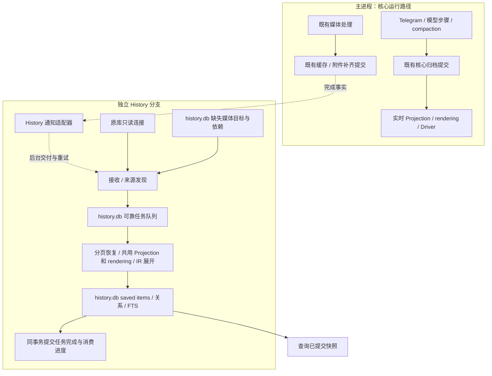

# History 异步同步架构

状态：2026-10-10 同步实现已按本文改造，包含可靠构建任务、媒体完成交付及定向恢复。具体输入/生命周期契约见 [history-input.md](history-input.md)；查询 SDK、SQL guard 和 memory 仍未实现。

## 固定约束

1. 主进程从归档提交到实时 Projection、rendering、Driver 的整个路径，均不等待 History 就绪、接收、持久入队、ACK、构建或追平。History 错误不进入 ingress 的提交重试，也不回滚核心归档。
2. History 的构建输入和 rendering 工作不可丢弃。已提交来源最终必须进入构建；已经入队的工作必须完成，或保留可重试状态。队列满、重启和构建失败不能静默跳过目标。
3. 同步状态全归 History：来源游标、待交付/待构建任务、依赖、重试和消费进度只存 `history.db`。原库不增加同步字段、表、索引、触发器或写入。
4. Projection、rendering 和 IR 展开共用实现。实时分支和 History 分支各自拥有状态、窗口、调度和失败处理；不共享实时分支的执行栈或生命周期。
5. 正常媒体补齐走完成通知与定向任务，不按定时器逐个轮询缺失媒体，也不扫描完整旧归档或缓存表。

这几个约束同时成立。不能把“不可丢弃”实现为主进程等待 History 持久确认，也不能把“完全异步”实现为遇到压力就丢弃 rendering 输入。

## 数据流和所有者

实线构建链路由 History 调度。主进程与 History 之间没有等待构建或入队成功的返回边；通知适配器的后台交付不参与主流程完成条件。

| 所有者 | 职责 |
| --- | --- |
| 核心归档 | 按既有规则保存 canonical events、TR、compactions 和媒体结果；不认识 History 的消费位置 |
| 实时 Pipeline / Driver | 服务当前群的实时窗口和模型流程；不生产需要自己等待确认的 History rendering 队列 |
| 通知适配器 | 接收媒体已完成的事实；异步交付、重连和恢复请求；不执行 rendering 或 History SQL |
| History 来源发现 | 从三个来源的新 ID 分页读取，登记目标和媒体依赖，将工作持久入队 |
| History 构建调度 | 消费同一可靠队列，按需恢复稀疏状态并调用共用 Projection/rendering；负责限速、重试和恢复 |
| History writer | 唯一写入者；原子提交 saved items、关系、FTS、状态及任务进度 |
| 查询分支 | 读取已经提交的检索快照，返回覆盖范围和落后状态；默认不等待构建 |

“共用 rendering”指共用表示和构造规则。可靠交付的单位是有持久来源定位和依赖的构建任务；History 自己执行或恢复 rendering。实时 Pipeline 的临时 RC 对象不能成为唯一构建输入，否则主进程崩溃后无法兑现可靠性。

实现已取消可丢弃 rendering hint 输入，History 持久任务负责完整构建。若以后增加跨分支结果复用，必须有独立的版本校验和恢复证明，不能替代可靠任务。

## 归档发现、分页与可靠入队

三个来源是 `events`、`turn_responses_v2` 和 `compactions`。正常消息、edit/delete、self-event 合并事件、runtime、TR 和摘要均通过新增归档 ID 被发现。时间较早的新行仍由 ID 增量读取覆盖。

- 初次捕获有限 ID 上界，分页建立 History 自有来源定位索引，再按群和 canonical 时间顺序构建。保留每个来源的独立覆盖状态。
- 持续发现只读持久 ID 水位之后的新行。来源任务、指纹、定位索引、缺失媒体目标与发现游标在同一 History 事务提交。
- 发现器只有在任务已持久保存后才能推进游标。构建器慢时可以暂停发现器；尚未读取的来源继续留在核心归档中。
- 新增消息、编辑、删除、TR、摘要和媒体刷新进入同一构建调度体系。大 fanout 分成持久子任务，不能只处理前几个目标。
- 一个 task 可以有完整 rendering 输出，也可以暂时只有足够恢复它的来源定位。完成条件始终是可读条目和相关状态已提交，不能以“已尝试发送 rendering”代替。

分页只限定单次读取和工作量，不表示每轮从第一页重新开始。正常增量不会回扫已完整的旧行。旧目标只因新 edit/delete、回复依赖或明确媒体完成而被定向恢复。

来源发现与慢构建在调度上分开，但可由同一 child、同一唯一 writer 串行执行事务；不因此引入第二个 writer 或跨库事务。它们用各自持久进度恢复，不要求物理上拆成两个新进程。

## 媒体完成进入同一队列

### 先登记尚未完成的职责

History 读取来源时，只要发现缺失动画 hash 或描述，就持久登记待补齐目标：动画用 event ID，描述用 cache key，并保存其消息依赖。这一步与来源发现游标原子提交。尚未发现的来源本身仍可从归档读取。

已有媒体处理继续负责下载、resolver 和核心媒体结果保存。History 只读现有结果，不发起媒体下载或模型调用。原库既有的附件 hash 回填保留其原有职责，不加入 History 确认或进度。

### 正常完成路径

1. 媒体生产者完成既有缓存或附件提交后，发布带 event ID / cache key 的完成事实；同步调用只登记通知，不等待交付确认。
2. 通知适配器在后台交付。History 接收端查询对应待补齐目标及依赖，向可靠构建队列加入定向刷新任务。
3. 完成事实作为定向检查任务持久写入 `history_build_inputs` 后，后台发送端得到接收 ACK。History 随后读取该任务，向既有观察/消费链路安排刷新，并与 pending 的 `scheduled_seq` 原子提交；ACK 不等待这次检查、Projection、rendering 或 FTS。
4. 构建器按任务读取当前已提交媒体结果，刷新受影响条目。相关输出、任务完成与待补齐状态的清理原子提交。

通知适配器可以等待或重试自己的 ACK；主进程的 ingress、实时 rendering、媒体完成返回和 Driver 均不等待这个 ACK。这里的 ACK 是异步分支内部的交付协议。

### 通知中断和崩溃窗口

仅靠内存通知和 IPC ACK，不能保证主进程崩溃前的最后一条通知存活。可靠性依赖的是核心来源加 History 已登记的待补齐职责；不能声称原库和 History 的写入跨库原子。

| 中断位置 | 恢复依据 |
| --- | --- |
| 核心归档提交后，发现器尚未读取 | 持久 ID 游标尚未推进，恢复后继续增量读取 |
| 媒体完成先于 History 发现该来源 | 发现时直接读取已存在的 hash/描述，不需要历史通知 |
| History 已登记缺失目标，媒体已提交，通知尚未持久接收 | 启动、重连或明确交付缺口时，对持久 pending 和已登记媒体依赖集合做有限定向核对 |
| 刷新任务入队后，ACK 丢失 | 重复投递按目标/来源版本幂等；不新增重复输出 |
| rendering 已计算，输出事务未提交 | 任务仍未完成，恢复后重新构造并提交 |
| 输出事务已提交，进程尚未返回 | 读取已完成任务和消费位置，不重复应用状态 |

通知适配器的待交付内存必须有界。空间不足时保留一个“需要核对 pending 和媒体依赖集合”的恢复标记，由后台重试到 History 确认已持久安排核对任务；不保留无界的媒体 payload，也不阻塞主流程。适配器重启或重新连接时无条件请求一次这种核对，覆盖其内存标记随主进程退出而消失的窗口。

核对任务的 pending ID 与媒体依赖 cache key 枚举水位/位置归 `history.db`；按有限页处理，完成后清除恢复请求。扫描期间新登记的缺失目标要在登记后重读一次当前媒体结果，覆盖“通知先到、登记后到”的竞争。未完成目标核对后仍保留 pending，等待后续完成通知。

正常运行不按一秒定时器检查每个 pending。重复投递的重试是通知交付重试；失败构建任务的重试是构建重试；恢复核对只在启动、重连、通知缺口或明确人工恢复时触发。新增归档 ID 的轻量发现独立保留，不能与全量旧行重扫混为一谈。

这里保证媒体完成后相关 transcript 最终更新到可读取的当前结果，不承诺记录每次中间缓存值或保留每次通知的时间线。不同群的 resolver 并发生成同一缓存 key 时，后完成者可以覆盖描述。已完成依赖也参与启动、重连与溢出核对，不能以 pending 已清除为由忽略它。任意旧 TR/正文手工改写和物理删除仍需显式重建。

## 一次任务的提交规则

任务至少带 generation、chat、任务种类、来源定位/目标、依赖及幂等身份。媒体任务可以共享全库 cache key，但每个刷新输出必须绑定受影响群和消息。

构建器恢复当前目标及直接依赖，用共用 reducer/rendering 生成完整可读内容。来源 revision 和显示身份必须匹配；过期计划不能覆盖新消息状态。需要合并刷新时，持久记录被合并任务由哪个后继任务覆盖，不能直接删除待办。

以下内容在同一 History 事务提交：

- saved items、工具/消息/摘要关系和 FTS；
- 稀疏 Projection state、来源 revision 与依赖索引；
- 需要继续执行的子任务；
- 本任务完成标记及允许推进的消费进度。

失败任务保留并报告错误，不推进其完成位置。不同群可公平调度；同一目标的依赖顺序不能绕过。任务无需保证执行一次，需保证重复执行后状态一致。单条大消息或 TR 不因入队尺寸被截断，必须以持久来源引用恢复完整内容。

## 进度、背压和资源

| 进度 | 含义 | 所有者 |
| --- | --- | --- |
| 来源发现 ID cursor | 哪些来源已经可靠转换为待构建职责 | History |
| Bootstrap cursor / coverage | 哪个群、哪个来源的固定基线已物化 | History |
| Consume cursor / task 状态 | 哪些已入队职责已经完整物化 | History |
| Pending media / recovery cursor | 哪些目标仍缺结果、哪些恢复核对已完成 | History |
| Compaction cursor | Driver 的实时模型窗口 | 核心 Driver |

队列积压、磁盘写入失败或构建过慢时，背压停在 History 发现器和构建器。发现器不推进尚未可靠入队的 ID；已持久任务保留。原库仍按核心需求运行，主进程不代写 History、不接管无限内存队列、不等待恢复。

主进程只承担有界通知登记；独立分支承担解码、稀疏状态恢复、完整 rendering、FTS、限速和重试。短来源读事务及时释放，避免长时间钉住原库 WAL。独立进程仍共享 CPU、磁盘等物理资源，需要限速和实测；“不等待 History”不等于资源影响为零。

队列与 pending 的磁盘容量不承诺无限。History 写入不可用时停止推进并暴露错误；恢复后的可靠性以权威归档和 History 持久状态仍存在为前提。原库 retention 或文件丢失必须单独处理，不能靠异步架构恢复已经不存在的证据。

状态分别报告来源水位、基线 coverage、待构建量、pending media、恢复核对状态、错误和实际内存/吞吐。队列为空只说明已发现任务已完成，不证明来源已追平或缺失媒体已经完成。

## 生命周期与开关

`config.yaml` 顶层 `history.enabled` 默认为 false，启动时读取，对整个独立回查层及未来 tool / agent Interface 生效。已有 `read_old_messages` 不属于此层，保持独立。

启用时，主进程启动 History 分支后按既有顺序启动 Telegram 和 Driver，不等待 History 打开数据库、迁移、恢复或回填。History 自行恢复任务、发现游标及 pending；连接建立时安排一次有限恢复核对。历史群和未配置群由 History 独立发现，不改变 Pipeline residency。

关闭时不创建 History worker、队列或通知链路。核心归档和媒体结果继续保存；重新开启从持久来源水位补齐新增记录，并定向核对既有 pending。

Shutdown 停止核心生产者及晚到回调，然后停止通知适配器，为 History 当前小事务提供有限关闭时间；不等待清空队列或补齐媒体。异常退出依赖已提交来源、任务和 pending 恢复。恢复请求不能只存在于一个不重建的内存标记中。

查询读取已提交快照并报告 `index_not_ready`、`not_indexed` 和 coverage；默认不等待 builder。未来查询工具/API 的关闭、授权和错误均通过共同 capability 执行。

## 表示完整性

可靠队列能恢复已经持久保存的事实，不能补造核心归档从未保存的数据。当前来源没有保存 Telegram 显式 reply quote；因此 History 不能宣称重建结果总与实时临时 rendering 对象逐字相同。完整保存 quote 如需实施，属于独立的核心归档保真需求，需要明确迁移，不作为本次同步设计的隐含改动。

历史 rendering 保留来源中的完整可读正文、工具参数/结果及摘要；不受实时 compaction 窗口、模型 token 裁剪或 sender 遮罩影响。查询时再执行授权。saved items 不保存 Sharp、图片像素或 reasoning。

## 实现对应关系

| 事项 | 此前实现 | 本次实现 |
| --- | --- | --- |
| 主进程等待 History | 不等待 | 保持完全异步，持久接收 ACK 只由后台适配器处理 |
| 原库同步职责 | 子进程只读，无新增同步字段/CDC | 保持，新增迁移 0004 只修改 history.db |
| 新 ID 发现和事务任务 | 已有 | 复用；物化失败时在 256 条待消费观察处暂停来源发现 |
| Rendering 输入 | Pipeline hint 可因 credit、尺寸或淘汰丢弃 | 已移除 hint 路径，由 History 持久任务调用共用 rendering |
| 媒体补齐 | Pending 定时轮询 | 完成通知入持久输入队列，随后接入原有物化任务链路 |
| 通知交付恢复 | 无可靠完成通知协议 | 有界后台交付、持久接收 ACK、重试、重连/溢出恢复与一次登记核对 |
| 查询 SDK / SQL guard / memory | 未实现 | 仍待后续实现 |

持久输入检查、来源观察及 fanout task 是同一 History 构建链路的不同阶段。接收阶段不解析正文、不 rendering；慢检查/物化在独立 child 调度。每个阶段通过持久状态接续，只有一个 History writer。输入与 pending 的有限恢复 cursor 由 `0004_async_media_delivery` 迁移保存，旧 pending 目标和 generation 身份保留。

此前百万 token 验收不能单独证明新增通知协议；本次加入真实子进程的接收失败、ACK 后物化失败/SIGKILL、最后一次通知丢失恢复，以及登记竞争、饱和和背压测试。运行实例、部署配置和已有生产数据没有替换或修改。

验收结果见 [异步同步实现验收](history-async-acceptance-2026-10-10.md)。

## 实施与验收

实现复用了 History 观察/构建链路，加入持久媒体输入和恢复任务，并移除了 hint 路径与正常 pending 轮询。后续维护仍须遵守 History 自有迁移和完全异步约束，不能在 ingress 加入确认等待。

必须验证：

- History 未就绪、停机、数据库不可写、任务失败和 IPC 无 credit 时，主进程继续归档、实时 rendering、Driver 和媒体完成处理。
- 主进程崩溃发生在媒体提交后、通知送出前；恢复后最后一个 pending 仍被补齐。
- Worker 崩溃发生在接收提交前后、rendering 后和输出事务前后；任务不丢、输出幂等。
- 媒体完成在依赖登记之前、之后及登记事务期间到达，重复或顺序颠倒都收敛到正确状态。
- 通知内存饱和时，恢复请求被持续重试并持久安排；后续没有新通知时也不会永久遗漏最后一次完成。
- 正常媒体完成无需 pending 定时轮询；恢复只读 pending 定位与已登记 cache key 的当前结果及指纹，变化时才重建关联目标；不读取全部旧消息正文。
- 大 fanout、百万 token 单条内容和长时间积压不被尺寸/数量上限截断；测量主进程与 child 的真实资源影响。
- 停用、开启、新群和仅 TR/summary 的群均有独立 coverage；开关同时控制未来 tools/API，既有 read_old_messages 保持独立。

## 编辑覆盖与历史恢复

普通追加 edit 读取已物化消息状态，只应用有效的新覆盖事件；保留作者、首次时间、删除标记与回复时的快照。不会因消息累计编辑次数增加而消耗更多状态条目预算。

乱序插入、原事件媒体补齐或需要回复时点的父消息时，按 `(received_at,id)` 选择原消息、必要 self-send/权威 echo、有效覆盖正文的事件、最近编辑时间与删除证据。中间 edit 正文不解码。来源指纹从 History 私有索引以 keyset 逐条读取；有效前缀追加新指纹，失效前缀在物化事务内重建指纹链，不把全部修订保存在内存计划中。既有数据库形状、sourceRevision 算法及 generation 身份保持一致。

### 媒体派生状态刷新

History 保存的 IC 节点包含已选择的媒体描述，它们属于派生输出。收到 `image_alt_texts` 完成/变化通知时，定向恢复受影响消息与回复发生时依赖的有效原始事件，再按共用 hydrator 的优先级选择当前描述；不把已保存的非空 `altText` 作为权威来源。仅恢复原消息、有效 edit/delete/echo 正文，中间编辑仍只流式处理指纹。来源自带描述与贴纸信息保留，正文、FTS、消费进度和 pending 清理仍在同一事务提交。普通编辑继续复用已物化前缀；不增加全归档重扫或正常运行的 pending 轮询。

升级迁移 `0005_refresh_media_descriptions` 不改变表结构。它仅从 History 已有依赖索引为在线 generations 追加每个缓存 key 一条持久 source-change，由既有有界消费链路定向重建历史消息/FTS；覆盖 pending 已清除的旧派生输出，保留 generation、来源游标与已提交消费进度。不扫描原库正文，迁移只执行一次。直接缓存通知即使无 pending 也核对来源变化；pending 是缺失职责，不是通知相关性的判定依据。

### 大批量删除与已完成媒体恢复

删除事件目标总数不受 `maxStateEntries` 限制；该限制只约束单步工作空间。来源仍遵守既有编码字节预检，不截断目标列表。在线消费持久 `targets` 任务，以 ordinal 游标按有限页展开 message/replies 子任务；子任务插入与 ordinal 推进原子提交，全部目标完成后才推进 consume seq。Bootstrap 每步删除一个已存在消息，消息修订指纹与输出/FTS 原子提交，作为该目标已处理的证据；事件 checkpoint 保留在前一事件直到目标处理完毕，未知目标不会阻塞。失败和重启均复用这些 History 进度。

Recovery 接收 ACK 前在一个事务持久安排两种有限任务：pending 的 ID 水位核对，以及所有已登记媒体依赖的 cache key 水位核对。每步只读一个定位/当前缓存结果；指纹未变不产生物化任务，指纹变化才进入既有 cache fanout。后者包含已经完成并清除 pending 的依赖，因此后完成 resolver 覆盖共享缓存、且通知在溢出时丢失也可收敛。两类 cursor 随检查结果同事务推进；重连/新缺口重新请求核对，覆盖枚举期间的竞争。不加入正常定时媒体轮询或原库扫描。

History 迁移 `0006_bounded_recovery` 仅为 `history_build_inputs` 增加 `after_key`/`upper_key` 并为已有 generations 安排一次依赖核对；保留已有 pending、游标、generation 和输出。原库 schema、同步职责及主进程完全异步边界保持不变。
