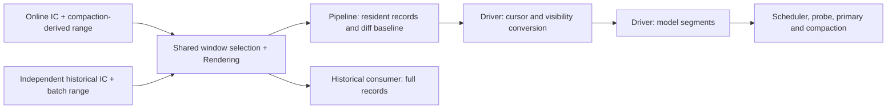

# Rendering and model-context interfaces

The reusable record and model-context contracts serve different consumers. They have different shapes and owners, so passing a rendering result directly to model consumers is a type error.



## Shared output window

```typescript
const renderer = createRenderer(); // owned by one consumer/chat
const records = renderer.render(ic, renderParams, {
  fromReceivedAtMs: 1000, // inclusive
  untilReceivedAtMs: 3000, // exclusive
});
```

The explicit input state is `IntermediateContext`; `ic.sessionId` supplies chat scope. Rendering does not own Projection state, load archives, or read online Pipeline/Driver state. Stateless `render(ic, params, window)` uses the same selection and formatter as the cached entry. Omitted bounds are unbounded; equal bounds produce an empty window. Selection happens before XML formatting, metadata copying, revision serialization and Sharp construction. A range scans the supplied IC's nodes; it does not claim O(window-size) lookup or cap the IC itself.

Online Pipeline calls this entry with its rendering window. Startup and Driver map the compaction cursor to `fromReceivedAtMs`. A historical consumer uses a separate IC, renderer and batch range; it is unaffected by online cursor advancement or visibility policy. Each renderer keeps only its last selected node set, and `retainWindow(window)` can release excluded entries without rendering. Overlapping unchanged records reuse their bodies/images; leaving and later re-entering a window may require reconstruction. These are runtime results, not an IPC protocol.

The range defines output, not which events are sufficient to restore state. Replies may reference earlier messages; later edits/deletes may change an older output window while preserving original message time and reply snapshots. Callers must supply appropriate restored state and revisit affected ranges. A naked timestamp cannot track complete build progress, especially for tied timestamps or multiple chats. Archive pagination/source revisions and durable consumer progress remain outside this interface.

`src/rendering/window.test.ts` exercises actual online Pipeline and a simulated independent historical consumer through the cached entry, including preceding reply state, later edits/deletes of earlier messages, independent policy/state, tied timestamps, excluded-content guards and cache reuse/eviction. It does not implement a real builder.

## Rendering's public record

`src/rendering/types.ts` owns a discriminated union of message, system and runtime records:

```typescript
{
  kind: 'message',
  metadata: { chatId, messageId, receivedAtMs, sender, replyTo, /* ... */ },
  presentation: { body, blocked },
  activation: { isMyself, mentionsMe, repliesToMe },
}
```

The metadata is an explicit output contract. It carries identity, timestamp and message-state information without exporting an `ICNode`, its content tree or its cache revision. Sender/reply/forward and attachment metadata are copied into independent read-only snapshots. Attachment metadata contains descriptions and logical attributes, not thumbnail bytes. Runtime metadata carries task identity; system records need only the shared timeline metadata.

`transcript` contains full message body text/XML and untruncated reply snapshots for host-internal historical consumers, including deleted bodies. Its plaintext includes attachment and custom-emoji descriptions for FTS. It has no image handles or bytes. Runtime `presentation.body` continues to use reply previews and deleted-message tombstones, with image handles where applicable. Rendering also prepares the header-only blocked form from the same attributes. These are display forms; Rendering does not read a block list or decide a consumer's window; it applies the explicit output range supplied by that consumer. Activation facts depend only on source content and the bot identity used by formatting.

The IC node identity, revision comparison and cache entries are private to `createRenderer()`. Source and display-parameter changes invalidate records; view, summary, model and budget changes do not. Records and body arrays are read-only. Sharp handles are shared runtime resources; request codecs clone them before resize/encoding.

## Driver's model context

`src/driver/context-types.ts` owns the existing model segment contract:

```typescript
{
  receivedAtMs,
  content,
  senderId,
  // Scheduling and activation flags only.
}
```

`selectContextView()` is the explicit conversion. It applies the cursor, selects normal or blocked presentation, suppresses blocked images and mention/reply flags, and copies only model/scheduling fields. It never spreads a record or its metadata. Scheduling, probe, primary, merge and compaction accept this model contract. Live inputs and historical `read_old_messages` both cross this conversion.

The distinct shapes provide the check: rendering records have no model `content` array or top-level `receivedAtMs`, and model segments have no record `kind`, `metadata` or `presentation`. No brand casts, compatibility aliases or generic wrapping adapters are needed. Type assertions in the context-view tests verify that neither collection is assignable to the other or to model-consumer inputs.

## Pipeline's lifetime

Pipeline owns online state and passes its output range to the common Rendering entry. `setRenderWindow(chatId, window)` snapshots the range and prunes retention without construction. Narrowing removes excluded records immediately; widening is materialized on the next event or replay, not by the setter. Startup can seed a window before replay. Driver's compaction adapter first checks residency, then maps its cursor to the lower bound. Window updates evict renderer cache entries and filter its stored record array, without regenerating content or publishing input. Filtering preserves retained record identity and prevents a later diff from treating all compacted messages as deletions.

Driver holds its own input snapshot. Its metadata signal advances the model view independently; the Pipeline array replacement does not mutate that snapshot. Old records referenced by Driver remain alive until the next input replaces it. Neither this contract nor caching requires an all-history rendering collection. Cold replay still loads the active event window; Projection's existing IC/reply-snapshot lifetime is unchanged.

## Scope

The historical input consumer now uses these interfaces against real paginated archives; see [Historical archive input](history-input.md). Persistence supplies archival IDs/fingerprints, while history restores structured per-target dependency state into a sparse IC, applies the shared pure reducer and renders only touched projected messages with an explicit range. Its durable bootstrap transaction stores items, relationships, full-content FTS, state and checkpoints in an independent history.db. Renderer cache is released after each pass; neither output windows nor renderer revisions become durable progress. The standalone CLI runs outside bot startup. Independent online discovery, durable tasks/media receipt, reconciliation and worker lifecycle are implemented; query APIs remain deferred. Consumers do not access renderer cache internals or infer identity from XML.

## Reliable History rendering work

Pipeline does not publish rendering hints. History discovers committed archive sources and persists tasks before advancing source cursors, then restores its own target/reply state and calls the same rendering entry. Output, dependency state, FTS and task completion commit atomically in history.db; failure retains the task for retry. Runtime renderer cache entries and their revisions remain private and transient.

Media completion locators enter the asynchronous durable input path and schedule targeted rendering work through the same History consumer. Receipt ACKs do not wait for rendering, and no main/core producer waits for an ACK. See [the synchronization design](history-sync-design.md) and [implemented input contract](history-input.md).
